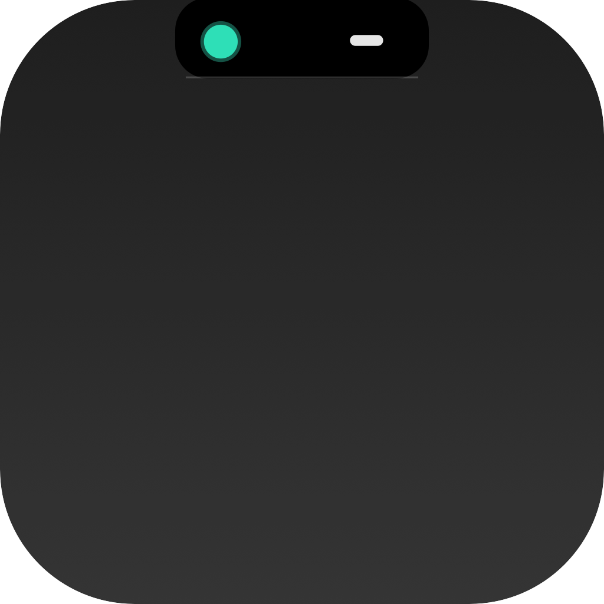
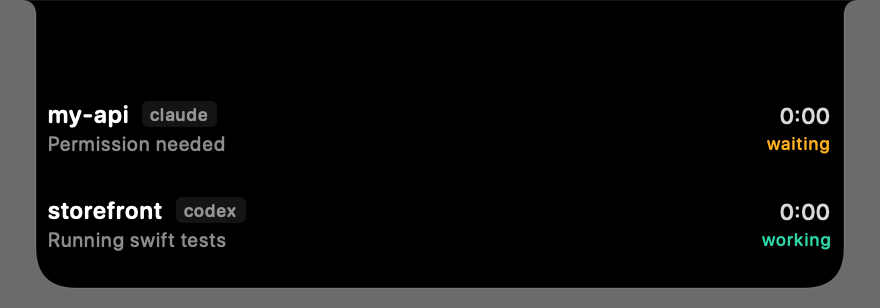

<p align="center">
  
</p>

<p align="center">
  <a href="README.md">English</a> | 简体中文
</p>

# Notch

[](https://github.com/hyderay/notch/actions/workflows/ci.yml)
[](https://github.com/hyderay/notch/releases/latest)
[](https://github.com/hyderay/notch)

在 MacBook 刘海中实时显示 Codex CLI 和 Claude Code 的工作状态。

<p align="center">
  
</p>

当 Codex CLI 或 Claude Code 工作时，Notch 分为三个层级：`0` 完全隐藏、`1` 紧凑状态、`2` 完整会话面板。双指向 Notch 推动时逐级 `2 -> 1 -> 0`，双指远离 Notch 时逐级 `0 -> 1 -> 2`。点击可在 `1` 和 `2` 之间切换，鼠标移出层级 `2` 的面板后回到层级 `1`。没有任务运行时，手势不产生响应。

双指手势每次成功切换层级都会产生一次 Force Touch 触觉反馈，展开和收回方向一致；到达边界后的无效手势、点击、鼠标移出收起和自动展开保持静默。手势与触觉反馈均可在菜单栏中关闭。

## 功能

- 自动跟踪 Codex CLI 和 Claude Code 本地会话
- 显示并发任务、当前操作、运行时间和权限请求
- 原生集成 MacBook 硬件刘海
- 可选 Agent Hooks，提供更精确的状态更新
- 提供本地 `notchctl` 命令行接口
- Agent 数据保留在本机，无账户与分析统计；更新检测仅请求公开的 GitHub Release 元数据

## 系统要求

- macOS 14 或更高版本
- 带硬件摄像头刘海的 MacBook 显示屏
- 可选：[Codex CLI](https://github.com/openai/codex) 和/或 [Claude Code](https://claude.com/claude-code)

## 安装

### Homebrew

```bash
brew install --cask hyderay/tap/notch
xattr -dr com.apple.quarantine /Applications/Notch.app
```

当前发布版本使用临时签名，因此首次启动前需要执行第二条命令。

### 下载发布版本

1. 从 [最新 Release](https://github.com/hyderay/notch/releases/latest) 下载 `Notch-v*-macOS.zip`。
2. 解压并将 `Notch.app` 移动到 `/Applications`。
3. 在 Finder 中打开 Notch，或运行 `open -a Notch`。

如果 Gatekeeper 阻止首次启动，可右键应用并选择“打开”，或运行：

```bash
xattr -dr com.apple.quarantine /Applications/Notch.app
```

### 从源码构建

```bash
git clone https://github.com/hyderay/notch.git
cd notch
make install
open -a Notch
```

`make install` 会将 `Notch.app` 安装到 `/Applications`，并将 `notchctl` 链接到 `~/.local/bin`。

## 工作原理

默认情况下，Notch 增量读取 Agent 已经写入本地的会话记录：

| Agent | 监控位置 |
| --- | --- |
| Codex CLI | `~/.codex/sessions/**/rollout-*.jsonl` |
| Claude Code | `~/.claude/projects/**/*.jsonl` |

文件监控由 FSEvents 触发，空闲时不轮询。仅处理最近活动的会话，并在任务完成后自动清理显示状态。

安装可选 Hooks 可获得更精确的工具名称、任务边界和权限等待状态：

```bash
notchctl install-hooks
```

安装程序只追加配置并保留备份。撤销 Hooks：

```bash
notchctl uninstall-hooks
```

## notchctl

任何本地工具都可以向 Notch 推送状态：

```bash
notchctl working --agent codex --session build-42 --title my-app --detail "swift build"
notchctl waiting --agent codex --session build-42 --detail "等待确认"
notchctl done    --agent codex --session build-42
notchctl remove  --agent codex --session build-42
```

常用命令：

| 命令 | 用途 |
| --- | --- |
| `notchctl status` | 查看当前显示的会话 |
| `notchctl inspect` | 查看刘海几何与界面状态 |
| `notchctl doctor` | 检查 Socket、Agent 和 Hooks |
| `notchctl demo` | 演示所有界面状态 |
| `notchctl ping` | 检查应用是否正在运行 |

## 菜单栏

菜单栏提供 Hooks 安装、自动展开、双指手势、触觉反馈、演示和更新检测。Notch 启动后会检查一次 GitHub Release，只有发现新版本时才自动提示；选择 **Check for Updates...** 会始终显示检测结果。

## 隐私

Notch 只读取本机已有的会话文件，状态仅保存在内存中。启动时或手动检查更新时会向公开的 GitHub Releases API 请求一次版本元数据，不会上传会话内容、路径或使用数据。IPC Socket 位于权限为 `0700` 的目录中，文件权限为 `0600`，仅允许本地访问。

## 资源占用

以下数据于 2026 年 8 月 18 日在 M3 Pro 上使用已安装的 Release 构建测得，未开启调试日志；CPU 为单核占用比例。

| 状态 | 平均 CPU | RSS | 采样期间 RSS 波动 |
| --- | --- | --- | --- |
| 空闲，界面隐藏 | 0.70% | 55.6 MB | 48 KB |
| Agent 工作，紧凑模式 | 0.17% | 61.0 MB | 192 KB |
| 会话结束后 | 0.00% | 60.9 MB | 144 KB |

会话循环结束后的物理内存占用为 16.0 MB。`leaks` 仅报告了 20,016 字节的系统 NSXPC/AppIntents 循环引用，没有调用栈归属于 `Notch` 或 `NotchCore`。文件监控由 FSEvents 事件驱动，紧凑状态指示器没有随屏幕刷新率持续运行的动画。

运行 `make check-resources` 可复核资源门槛：空闲 CPU 不超过 1%，工作态 CPU 不超过 5%，RSS 增长受限，且项目代码没有泄漏。

## 开发

```bash
make build
make app
make install
make check-resources
```

项目使用 SwiftPM 构建，不需要完整 Xcode。架构、性能数据和实现细节请阅读英文版 [DESIGN.md](DESIGN.md) 与 [README.md](README.md)。
